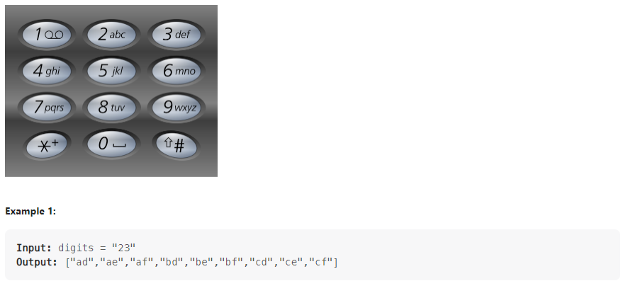

# **[python] Leetcode 17. Letter Combinations of a Phone Number**

https://leetcode.com/problems/letter-combinations-of-a-phone-number/description/

###  

### **문제 소개**

- 특정 휴대폰 숫자를 눌렀을 때, 나올 수 있는 모든 알파벳 조합을 반환하시오
- DFS를 이용해서 쉽게 풀 수 있었다.





 

 

### **Code**

```
class Solution(object):
    def letterCombinations(self, digits):
        if not digits:
            return []

        alpabet = [
            ["a","b","c"],
            ["d","e","f"],
            ["g","h","i"],
            ["j","k","l"],
            ["m","n","o"],
            ["p","q","r","s"],
            ["t","u","v"],
            ["w","x","y","z"]
        ]
        n = len(digits)
        answer = []

        def three_bits(word):
            if len(word) == n:
                answer.append(word)
            else:
                now = int(digits[len(word)]) -2
                for i in range(len(alpabet[now])):
                    new_word = word
                    new_word += alpabet[now][i]
                    three_bits(new_word)
                    
        three_bits("")

        return answer
```

- DFS를 재귀적으로 이용하여 풀었다.
- 다른 사람들은 alpabet 배열을 어떻게 사용했는지 살펴보았는데, 역시 하나하나 다 쓴다. 다른 점은 배열 대신 딕셔너리를 사용했다.
  - 배열 크기가 고정되어 있어서 속도상의 차이는 나지 않은 것 같다. 하지만 다음에는 나도 딕셔너리를 사용해야겠다.