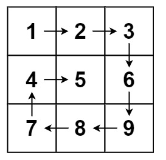
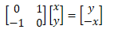
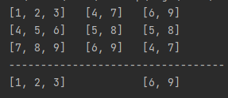

# **Leetcode 54. Spiral Matrix**

#### 링크 

https://leetcode.com/problems/spiral-matrix/

 

#### **문제 소개**

- 흔히 말하는 달팽이 문제이다! 오른쪽부터 시작하여서 막히면 90도 회전한다. 그리고 그 방문순서를 return
- 매우 다양한 풀이가 존재하는데 graph 순회 풀이 2개, 참신한 문제 풀이 1개를 소개할 예정이다. 
- 쿠팡 코테 문제로 나왔다 카더라..





 

#### **Graph Search Code**

```python
class Solution(object):
    def spiralOrder(self, matrix):
        if len(matrix[0]) == 1 and len(matrix) == 1:
            return [matrix[0][0]]
        movement = [[0,1], [1,0], [0,-1], [-1,0]]
        m = len(matrix)
        n = len(matrix[0])
        visited = [[0] * n for _ in range(m)]
        direction = 0
        x = 0
        y = 0
        visited[x][y] = 1
        answer = []
        answer.append(matrix[x][y])

        while direction >= 0:
            dx = x + movement[direction][0]
            dy = y + movement[direction][1]

            if 0 <= dx <m and 0<= dy < n and visited[dx][dy] == 0:
                visited[dx][dy] = 1
                x = dx
                y = dy
                answer.append(matrix[x][y])
            else:
                if direction == 3:
                    direction = 0
                else:
                    direction +=1 
                dx = x + movement[direction][0]
                dy = y + movement[direction][1]  
                if 0 <= dx <m and 0<= dy < n and visited[dx][dy] == 1:
                    direction = -1

        return answer
```

- 무한루프를 방지하기 위해서 vistied로 방문체크를 하고, 만약 graph 범위를 벗어났다면 방향을 전환하는 코드이다.
- 더 이상 방문할 수 없다면, 방향을 -1로 하고 while문을 종료시킨다.

 

#### **Graph Search Another Code** 

```python
    # utilizes the linear transformation for rotating -90 degrees in the plane
    def turnRight(self, vector):
        return (vector[1], -1 * vector[0])
```

- leetcode의 추천 코드의 일부인데, 같은 원리지만 이 분은 turnRight를 직접구현하였다.
- 아래 사진과 같이 선형대수학을 했다면, 90도가 돌아가는 코드를 설명할 수 있는데 이를 직접 간단한 원리로 구현하셨다. 이 부분이 인상 깊어서 추가로 소개하고 싶었다.





#### **Awesome Code** 

```python
class Solution(object):
    def spiralOrder(self, matrix):
        return matrix and list(matrix.pop(0)) + self.spiralOrder(zip(*matrix)[::-1])
```

- leetcode의 추천 코드의 오직 한 줄로 작성하였는데, 상당히 많은 걸 배울 수 있었다.
  1. matrix 가 있다면 계속 재귀를 진행하고, 빈 matirx라면 return 한다. 
  2. matrix.pop(0)로 현재 가장 상단에 위치한 줄을 그대로 정답에 넣는다.
  3. **zip(\*list)** 는 매트릭스를 unpack하여 재조립하는 것으로, transform 한 것과 같은 효과를 가질 수 있습니다.
  4. **list[::-1**] 는 매트릭스를 행 순서를 뒤집습니다.
  5. 위를 전개할 경우 아래와 같이 되면서, 다음 가고자 하는 방향이 맨 위로 올라온다.
  6. 1-5를 반복한다


