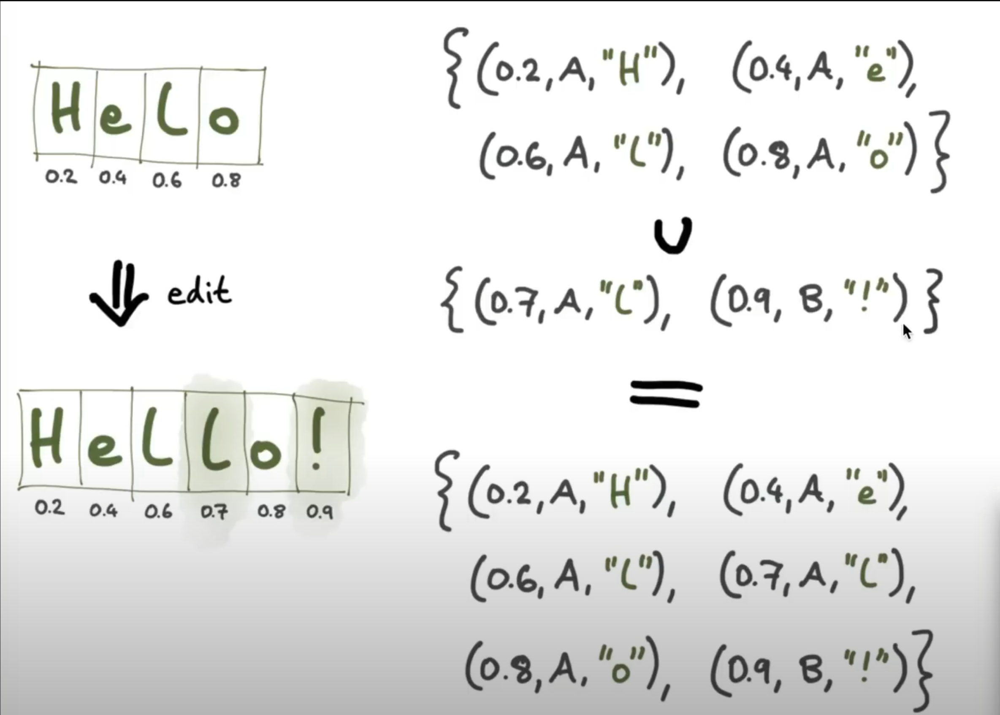
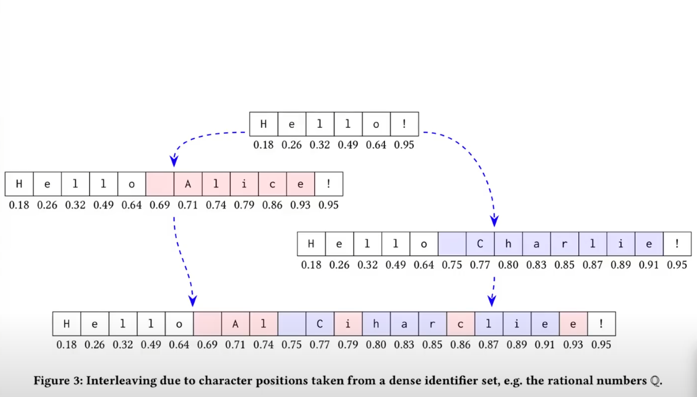
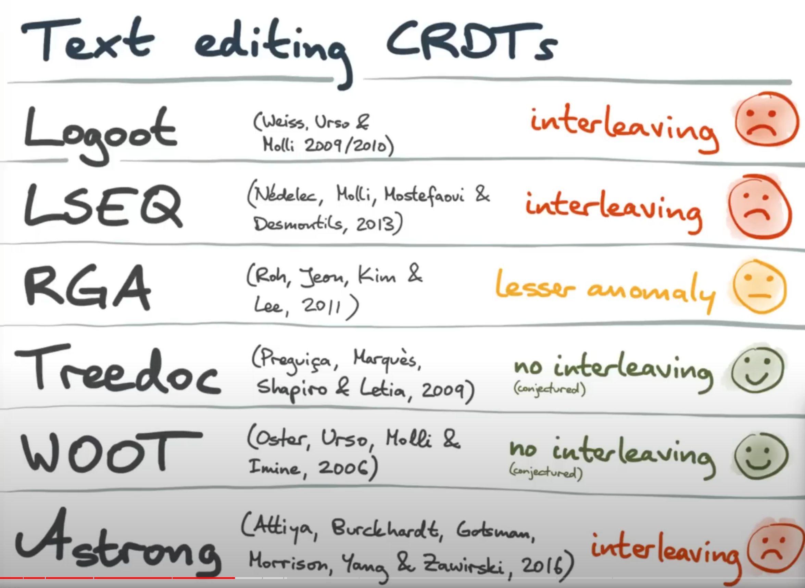
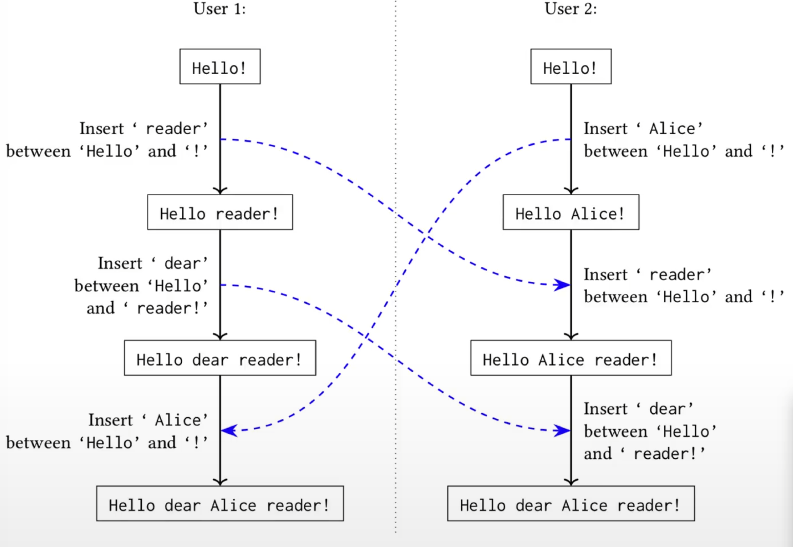
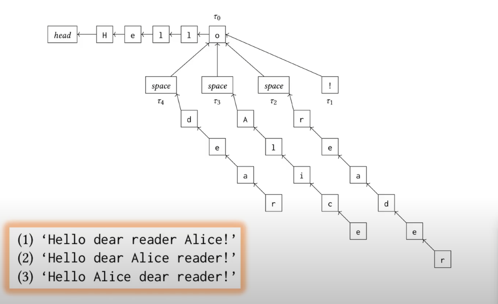

# CRDT : The Hard Parts

[CRDT : The Hard Parts](https://www.youtube.com/watch?v=x7drE24geUw&t=3s)

### 0:00 - intro

### 1:35 - text editing default (이전 설명과 중복됨)

### 2:35 - OT vs CRDT

OT

- 두 유저의 화면 값을 동일하게 만들기 위하여, 연산의 위치를 변환시키는 알고리즘을 적용함

- 단일 중앙 서버를 필요로 함. 

  - 단일 중앙 서버가 작업 순서를 계산함

  - 따라서, 네트워크 제한이 생김

    

CRDT

- OT에 네트워크 제한을 극복하기 위한 알고리즘

=> CRDT는 구현하기 쉬우나, 개발자가 원하던 결과와 다르게 구현될 가능성이 큼. 즉, 잘못 구현될 가능성이 매우 큼. 이 강의는 CRDT를 "잘" 구현하는 것을 소개하고자함

### 10:28 - TOPIC1. InterLeaving, 단순 텍스트 CRDT 구현

- 간단한 구현에서는 숫자를 이용하여 문자를 무한으로 표현할 수 있다.
- 실제로는 숫자보다는 트리로 많이 표현을 한다. 하지만, 아이디어는 결과적으로 동일하다
- 여러 편집자가 같은 곳을 편집하는 것에 대해서 고유 식별자(A,B)를 부여함으로써 순서를 정할 수 있습니다.

### 14:42 - TOPIC1. InterLeaving, 단순 텍스트 CRDT 예상 오류

- CRDT는 범위 내 무작위 숫자를 부여함. (충돌 확률이 낮기 때문에)
- 다만, 이는 결과론적으로 읽을 수 없는 문자를 만들어버림. 이는 단어가 아니라 섹션이나 더 큰 범위일 경우 훨씬 심한 결과가 되어 결과적으로 읽을 수 없는 문자를 만듬.

- interleaving은 CRDT 알고리즘의 핵심이기 때문에 이를 수정하는 것은 쉽지 않음.
- WooT와 TreeDoc에서는 이런 문제가 발생하지 않음. 하지만, 가장 효율이 낮은 알고리즘임
- LSEQ는 위를 최적화한 알고리즘이나 인터리빙 문제가 발생하게 됨
- 최신인 Astrong도 결국 발생함.
- RGA는 있긴한데 적은편

### 19:31 : RGA

- 마지막 삽입된 문자를 root로(부모로) 취급함. 

- 커서를 움직일 때마다 이를 기반으로 한 subtree를 생성하고 이를 깊이 우선 순회(dfs)를 진행함

- subtree를 방문하는 순서는 timestamp에 의해서 결정됨. 다만, 이 timestamp는 유저의 동작에 의한 것이므로 순서를 보장할 수 없으면 위 처럼 3가지 경우의 수가 나올 수 있음.

- 문서를 뒤로 작성하는 특이케이스가 없다면, 단어를 기준으로 인터리빙이 발생하여 상대적으로 좋은 의미를 가질 수 있음(커서가 움직이는 것이 기준이기 때문에)

- 복사나 섹션 추가 또한 앞에서부터 입력되므로 괜찮음

  관심 있다면 다음 논문을 추가로 참조 바람 [Interleaving anomalies in collaborative text editors](https://dl.acm.org/doi/abs/10.1145/3301419.3323972)