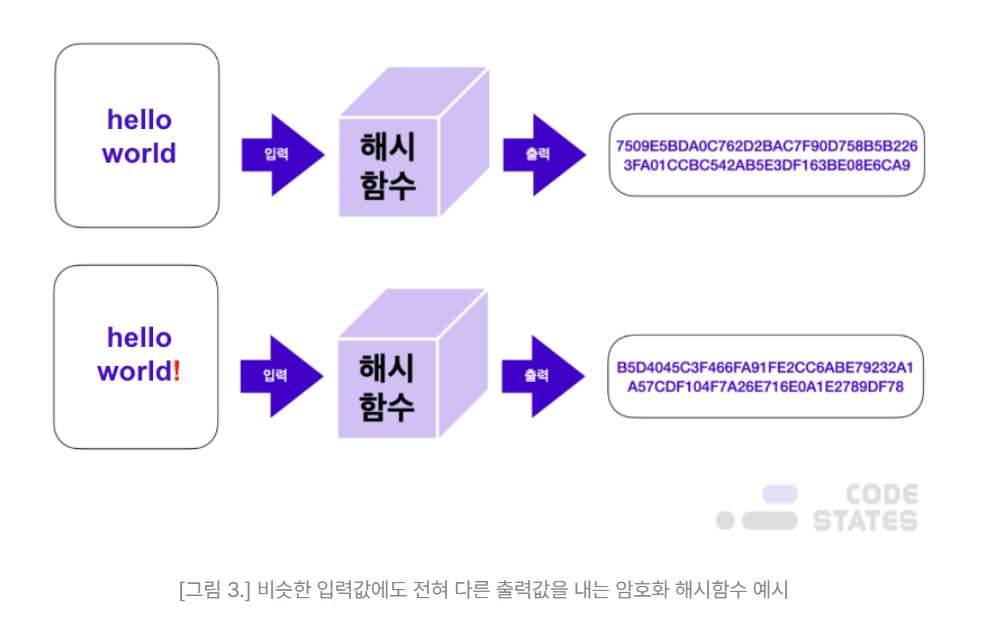
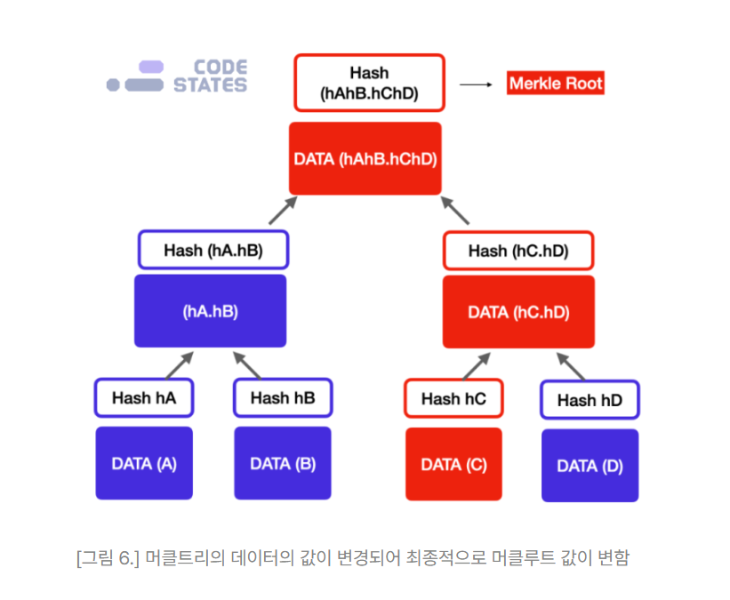

# Hash Function

### 해시함수란?

**해시 함수(hash function)는 임의의 길이를 가진 데이터를 입력받아 고정된 길이의 값, 즉 해시값을 출력하는 함수입니다**. 

해시값은 입력 데이터로부터 유도되기 때문에 동일한 입력은 항상 동일한 해시값을 갖게 됩니다.

주로 다음과 같이 사용합니다.

- 데이터의 무결성을 검증하기 위하여 ex). 암호학, 데이터 무결성 검증
- 데이터의 빠른 검색을 위하여 ex). hash table
- 데이터의 균등한 배치를 위하여 ex). Consistent hashing

해시함수의 예시 (Code States)

5로 나누었을 때, 나머지를 취하는 해시 함수로 0~4의 해시값을 반환한다.

### 해시 함수의 특징

##### 1. 단방향성

해시 함수는 단방향성을 가지고 있어서 **입력 데이터에서 해시값으로의 변환은 쉽지만, 해시값에서 원래 데이터로의 역변환은 거의 불가능**합니다. 이는 **해시 함수가 데이터의 무결성을 보장하고, 보안 용도로 활용되는 데에 중요한 특징**입니다.

이러한 단방향성을 평가하는 척도 중 하나가 **역상 저항성(preimage resistance)**입니다. 역상 저항성이 우수하다는 건 어떤 해시 함수가 **특정한 값을 출력하는 입력값을 찾기 어려움을 의미**합니다. 현재 보안에 사용되는 많은 암호화 해시 함수는 서로 다른 입력값에 대해 완전히 다른 출력값을 반환하여 입력값을 유추하기 매우 어렵습니다.

##### 2. 해시 충돌

**해시 함수는 서로 다른 입력에 대해 동일한 해시값을 출력할 수 있습니다. 이를 해시 충돌이라고 부릅니다.** 좋은 해시함수는 충돌을 최소화해야 하며, 보안 측면에서 안전한 해시 함수는 매우 낮은 충돌 확률을 보장해야 합니다.

이를 평가하는 척도를 **충돌 저항성(collision resistance)**으로 표현할 수 있습니다. 충돌 저항성이 우수하다는 건 어떤 해시 함수가 충돌하는 서로 다른 두 입력값을 찾기 어려움을 의미합니다.

##### 3. 고정된 결괏값의 길이

**해시 함수는 항상 일정한 길이의 결괏값을 출력**합니다. 입력 데이터의 크기가 다르더라도 항상 동일한 길이의 해시값을 반환하기 때문에 **블록체인과 같은 분산 시스템에서 데이터의 일관성과 효율적인 처리를 보장하는 데에 유용**합니다.

예를 들어 대용량 데이터에 변조가 일어났는지 확인할 때, 일일이 모든 데이터를 대조하는 것보다 데이터의 해시값을 비교하면, 변조가 일어났는지 쉽게 확인할 수 있습니다. 이러한 검사 방법을 **데이터 무결성 검사**라고 합니다.

### 해시 충돌

1. 분리 연결법 (Separate Chaining)

- 추가적인 메모리를 사용하여, 링크드리스트 형식으로 데이터를 저장한다. 데이터 조회 시에는 해당 버킷을 해시함수로 찾은 후, 이후 링크드 리스트를 순회하여 원하는 데이터를 찾는다.
- 이 방식으로 사용 시에는 O(n)까지 성능이 감소할 수 있다.

2. 개방 주소법 (Open Addressing)

   

- 근처에 빈 메모리로 들어가는 방식이다. 방식에 따라서, 가장 가까운 메모리를 선형적으로 찾거나(Linear Probing), 2의 배수로 찾는 방법(Quadratic Probing)이 있다.
- 이 방식 또한, 규칙에 따라서 순회해야하므로 O(n)까지 시간복잡도가 낮아질 수 있다.
- 데이터가 삭제되었을 때, Dummy node로 인하여 순회 시간이 오래걸리거나 버그가 생길 수도 있어서 주기적인 관리가 필요하다. 
- 아래 네이버D2 글을 보면, 잘 관리할 경우 Worst Case가 발생한 확률은 분리 연결법이 더 낮아서 분리 연결법을 선호을 많이 사용하는 것 같다. 실제로 java는 분리 연결법으로 되어있다.

3. resizing

- 해시 충돌이 너무 많이 일어날 경우에 시간복잡도가 낮아지게 되므로, 해시테이블의 사이즈를 늘리고 다시 hash 연산을 모든 곳에 적용해줘야한다.

### 해시 테이블

해시 함수를 사용하는 대표적인 예시로 해시테이블이 있다. 해시 테이블은 해시 함수를 이용하여  key-value 형태로 저장하는 자료 구조이다.

해시 함수를 사용하여  색인(index)을 버킷(bucket)이나 슬롯(slot)의 배열로 계산한다.

해시 함수를 1회 실행시켜서 찾으면 되므로 평균 시간 복잡도가 O(1)이 나온다.

(단, 해시 충돌이 나오면 시간 복잡도가 O(n)까지 상승할 수도 있어서 해시 충돌이 일어나지 않게 적절한 확장이 중요하다.)

### 머클 트리

데이터의 해시값들을 묶어서 다시 해시 연산을 만들어서 하나의 해시값을 만드는 데이터 구조.

각 해시값들을 기반으로 만들어지기에 데이터 변조가 있을 시 해시 값이 달라지게 되며 이를 추적하면 위조된 데이터를 쉽게 파악할 수 있다.(그림의 빨간색이 변조된 데이터로 그림처럼 추적할 수 있다.)

---

- [코드 스테이츠- 블록체인 해시함수](https://www.codestates.com/blog/content/%EB%B8%94%EB%A1%9D%EC%B2%B4%EC%9D%B8-%ED%95%B4%EC%8B%9C%ED%95%A8%EC%88%98)
- [위키백과 - 해시 함수](https://ko.wikipedia.org/wiki/%ED%95%B4%EC%8B%9C_%ED%95%A8%EC%88%98)

- [위키백과 - 해시 테이블](https://ko.wikipedia.org/wiki/%ED%95%B4%EC%8B%9C_%ED%85%8C%EC%9D%B4%EB%B8%94)

- [티스토리 블로그 - 해시테이블](https://mangkyu.tistory.com/102)

- [NaverD2 - Java HashMap은 어떻게 동작하는가?](https://d2.naver.com/helloworld/831311)