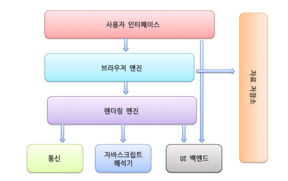
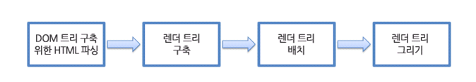
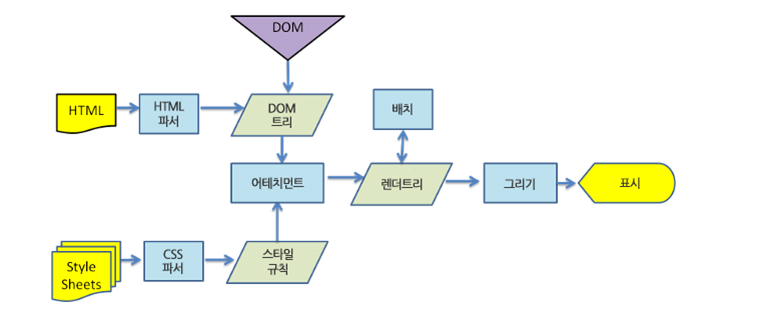
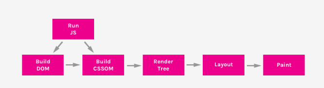
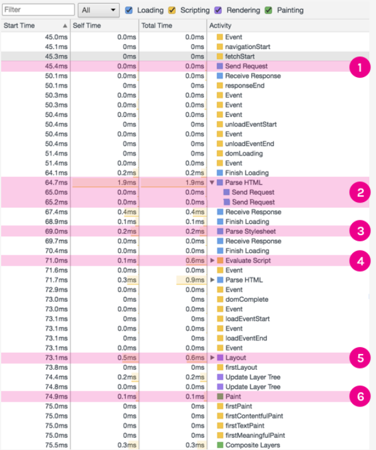
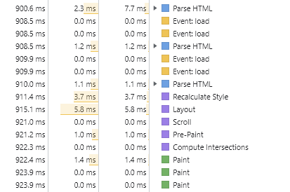
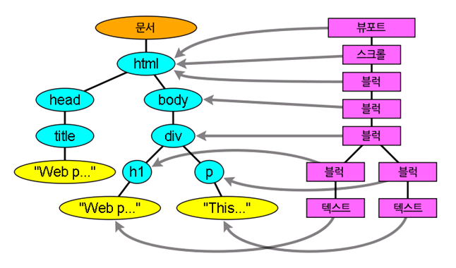

# DOM과 렌더링

### 글의 목적

- DOM이 무엇인지에 대해서 알고, 렌더링에 대해서 상세히 알아본다. 
- 렌더링 과정이 얼마나 부하가 걸리는 일인지를 이해한다. => 이를 통해서 VDOM이 왜 필요한 지 이해할 수 있을 것으로 생각된다.


### DOM

- 정의 : 문서 객체 모델(The Document Object Model, 이하 DOM) 은 HTML, XML 문서의 프로그래밍 interface 이다.

- 용도 : DOM은 문서의 구조화된 표현(structured representation)을 제공하며 프로그래밍 언어가 DOM 구조에 접근할 수 있는 방법을 제공하여 그들이 문서 구조, 스타일, 내용 등을 변경할 수 있게 돕는다.

- 구조 : nodes와 objects로 구성된다. 

- 발전사항 : 초창기 DOM은 JS와 밀접하게 연관되어 있었지만 지금은 분리해서 각각 발전되었다. 따라서 페이지 콘텐츠들은 DOM에 저장되고 이를 JS로 접근 및 조작하는 방식이 대표적이다.
  - `API (web or XML page) = DOM + JS (scripting language)`


### 렌더링 엔진

브라우저에서 사용되는 기본적인 엔진으로 요청 받은 내용을 브라우저 화면에 표시하는 일을 한다.

대표적으로 사파리와 크롬의 Webkit 엔진이 존재하며, 파이어폭스는 Gecko 엔진을 사용한다.

렌더링 엔진의 스레드는 거의 모든 경우 단일 스레드로 진행된다. 하지만 통신의 경우 몇 개 의 병렬 스레드를 사용할 수 있는데 보통 2-6개로 제한된다.




### 렌더링 엔진의 동작 과정


- HTML 문서를 파싱하고, 콘텐츠 트리 내부에서 DOM 노드로 변환한다. 그 후 외부 css 등 스타일 요소를 파싱한다. 이를 이용하여 렌더 트리를 생성한다.
- 렌더트리는 생성되면서 시각적 속성을 가진 사각형들은 정해진 순서대로 화면에 표시한다
- 렌더트리 생성 후, 각 노드를 화면에 정확한 위치에 배치시키는 배치과정이 진행된다.
- 그 후, UI  벡엔드에서 렌더 트리의 각 노드를 가로지르며 형상을 만들어내는 그리기 과정을 진행한다.
  - 아래 그림은 이 과정을 더욱 상세하게 표시한 웹킷의 동작과정이다.
  - 더욱 빠른 내용 표시를 위해서, HTML 파싱을 기다리지 않고, 먼저 배치와 그리기 과정을 진행하기도 한다.
  - 어테치먼트는 웹킷이 렌더트리를 생성하기 위해서 DOM 노드와 시각정보를 연결하는 과정이다.

※ 게코 엔진은 webkit엔진과 용어가 다르지만 기본적인 큰 원리는 동일하기에 여기서는 생략한다.




### Critical Rendering Path

- 위 부분을 조금 가볍게 표현하면 총 아래 6단계로 표시할 수 있으며 이 과정을 `Critical Rendering Path`라 부른다.

  

```
1. DOM Tree 생성
2. CSS DOM Tree 생성
3. JS 실행
4. Render Tree 생성
5. layOut
6. Paint
```

- 이 과정을 아래와 같이 eventlog를 통해서 확인할 수 있다고 한다. 





- 실제 웹페이지는 DOM을 생성하는 도중에도 계속해서 RenderTree를 만들고 Paint를 진행하므로 위처럼 이쁘게 나오지는 않지만 비슷한 결과가 나왔다




***이후에는 렌더링 엔진에 각 부분들을 좀 더 딥하게 들어가려 하며 이하 내용은 조금 복잡할 수 있다.***


### DOM 트리와 렌더 트리

- 파서에 의해서 DOM트리가 완성이 된다면 웹킷의 `렌더러(renderer)` 또는 `렌더 객체(render object)`가 표시해야 할 순서와 문서의 시각적인 구성 요소로써 올바른 순서로 내용을 그려낼 수 있도록 작동한다.
- 각 렌더러는 너비, 높이, 위치 등의 css 정보를 포함한다.
- 렌더 트리는 DOM트리와 1:1 처럼 보이지만 그렇지 않다. display나 hidden 속성에 따라서 렌더 트리에는 없는 요소도 존재하며, 드롭다운과 같은 요소는 표시 영역/ 드랍다운 목록/ 버튼 을 표현하기 위해서 3개의 렌더러가 대응하게 된다. 
- 여기서 viewPort는 최초의 블록으로 웹킷에서는 `RenderView`라 부르는 최상위 노드이다.
  - 웹킷에서는 스타일을 결정하고 렌더러를 만드는 과정을 "어태치먼트(attachment)" 라고 부른다. 
  - 모든 DOM은 "attach" 메서드가 있고  동기적으로 DOM트리에 노드를 추가하면 새 노드의 "attach" 메서드를 호출한다.

※ HTML 파서, CSS 파서 굉장히 복잡하고 중요하지만, 여기서는 다루지 않는다.



### 스타일 규칙 만들기

- 스타일의 계산은 매우 중요하다. 왜냐하면, 이런 시각적 속성들은 매우 광범위하고 다양해서 메모리 문제를 불러일으킬 수 있으며, 각 요소에 할당된 규칙들로 부터 맞는 규칙을 찾아내는 것은 굉장한 성능 문제를 가져오기 때문에 최적화와 매우 밀접한 부분이다.

- 스타일 정보 공유

  - 웹 킷은 형제 또는 사촌 노드에게 특정 조건 아래에서 스타일을 공유할 수 있다.(이 또한 자세히 다루지 않는다.)

    ```
    1. 동일한 마우스 반응 상태를 가진 요소여야 한다. 예를 들어 한 요소가 :hover 상태가 될 수 없는데 다른 요소는 :hover가 될 수 있다면 동일한 마우스 상태가 아니다.
    2. 아이디가 없는 요소.
    3. 태그 이름이 일치해야 한다.
    4. 클래스 속성이 일치해야 한다.
    5. 지정된 속성이 일치해야 한다.
    6. 링크(link) 상태가 일치해야 한다.
    7. 초점(focus) 상태가 일치해야 한다.
    8. 문서 전체에서 속성 선택자의 영향을 받는 요소가 없어야 한다. 여기서 영향이라 함은 속성 선택자를 사용한 경우를 말한다(속성 선택자 예 input[type=text]{...})
    9.요소에 인라인 스타일 속성이 없어야 한다(인라인 스타일 예 <p style="...">...</p>).
    10. 문서 전체에서 형제 선택자를 사용하지 않아야 한다. 웹 코어는 형제 선택자를 만나면 전역 스위치를 열고 전체 문서의 스타일 공유를 중단한다. 형제 선택자는 + 선택자와 :first-child 그리고 :last-child를 포함한다.
    ```

- 다단계 순서에 따라 규칙 적용하기

  - 스타일 객체는 모든 CSS 속성을 포함하고 있는데 어떤 규칙과도 일치하지 않는 일부 속성은 부모 요소의 스타일 객체로부터 상속 받는다.  그 외 다른 값은 기본 값이 된다.

  - 스타일이 여러 번 나타날 경우 중요도에 따라 적용되는 데 이 규칙 적용을 `다단계(cascade)` 순서라고 한다. 또한 같은 순서에서는 특정성에 의해서 정렬이 되고 표시된다. (이 정렬은 적을 때는 버블, 많을 때는 병합 정렬을 사용한다)

    ```
    1. 브라우저 선언 (browser declarations)
    2. 사용자 일반 선언 (user normal declarations)
    3. 저작자 일반 선언 (author normal declarations)
    4. 저작자 중요 선언 (author important declarations)
    5. 사용자 중요 선언 (user important declarations)
    ```

    ```
    선택자 없이 'style' 속성이 선언된 것이면 1을 센다. 그렇지 않으면 0을 센다. (=a)
    선택자에 포함된 아이디 선택자 개수를 센다. (=b)
    선택자에 포함된 속성 선택자(클래스 선택자와 속성 선택자)와 가상 클래스 선택자의 숫자를 센다. (=c)
    선택자에 포함된 요소 선택자와 가상 요소 선택자의 숫자를 센다. (=d)
    특정성 = a-b-c-d (큰 진법의 숫자에 맞춤)
    ```


### 배치

##### 배치와 더티 비트 체제

- `렌더러`가 생성될 때, 크기와 위치 정보는 없는 데 이 값을 계산하는 과정을 `배치`라 부른다
- 재배치할 필요가 있는 변경 요소 또는 추가된 것과 그 자식을 `더티`라고 하며, 플래그를 이용하여 표시한다.
  - 자식이 `더티`하다는 것은 본인은 수정사항이 없으나 자식 가운데 적어도 하나 재배치를 해야함을 의미한다
- 배치가 "크기 변경" 또는 렌더러의 위치 변화 때문에 실행되는 경우 캐시로부터 가져오는 방법을 이용하여 최적화를 진행한다.


##### 전역배치와 점증 배치

- 배치가 전범위에서 일어나는 경우를 `전역배치`라 하는데 이는 아래 두 경우에 발생한다
  - 글꼴 크기 등 전역 스타일의 변경
  - 화면 크기의 변경
- `점증 배치`는 더티 렌더러가 배치되는 경우로 추가적인 배치가 필요하기 때문에 약간의 손실이 발생할 수 있다.


##### 비동기 배치와 동기 배치

- 점증 배치는 `비동기 배치`로 웹킷의 경우 타이머가 있어서 트리를 탐색 후 더티 렌더러를 배치한다
  - "offsetHeight" 같은 스타일 정보를 요청하는 스크립트의 경우 동기적으로 점증 배치를 실행한다.
- 전역 배치는 동기적이며, 스크롤 위치 변화와 같은 일부 속성들은 동기적으로 점증 배치를 실행한다.


##### 배치 과정

1. 부모 렌더러가 자신의 너비를 결정 

2. 부모가 자식을 검토
   - 자식 렌더러를 배치
   - 필요시, 자식을 호출하여 높이 계산

3. 부모는 누적 높이, 여백 ,패딩을 사용하여 자신의 높이를 계산
4. 더비 비트 플래그 제거


##### 너비 

- 특정 블록에 대해서 `너비`,  `최소 너비`,  `최대 너비`를 계산하게 된다.
  - 이 너비를 바탕으로 너비가 최소보다 작으면 최소너비 너비가 최대보다 크면 최대너비를 배치하게 된다.
  - 너비가 고정된 경우, 일단 캐쉬에 저장되며 이 값을 재활용한다.


### 그리기

- `paint` 함수를 이용하여 UI 기반의 구성 요소를 사용한다.
- 이 또한 스택을 이용하여 뒤에서 앞으로 블록을 쌓는다

```
1. 배경 색
2. 배경 이미지
3. 테두리
4. 자식
5. 아웃라인
```

- 웹킷은 기존의 사각형을 비트맵으로 저장하여 새로운 사각형과 비교하고 차이가 있는 부분만을 다시 그린다.
  - 이렇게 변경에 대해서 최소한의 리페인팅만을 사용하려하는데 글꼴과 같은 일부요소는 전체를 다시 그리게 된다.


### 위치 결정 방법

- 위치는 아래 세 가지 포지션이 존재한다

```
1. Normal - 객체는 문서 안의 자리에 따라 위치가 결정된다. 이것은 렌더 트리에서 객체의 자리가 DOM 트리의 자리와 같고 박스 유형과 면적에 따라 배치됨을 의미한다.
2. Float - 객체는 우선 일반적인 흐름에 따라 배치된 다음 왼쪽이나 오른쪽으로 흘러 이동한다.
3. Absolute - 객체는 DOM 트리 자리와는 다른 렌더 트리에 놓인다.
```


### 결론 및 느낀점

- 브라우저는 굉장히 복잡한 원리로 만들어져있으며 이 과정의 결과물들로 DOM이 나온다.
- FireFox의 경우 비슷하지만 성능을 높이기 위한 더 다양한 방법들이 존재하는 데, 이런 부분이 FireFox가 좋다고 말하는 이유인가 싶었으며 이 글에서는 다루지 못했지만, 나중에는 한번 더 다뤄보고 싶다.
- CSS나 코드적인 부분은 과감히 생략한 부분이 많다. 더 상세한 내용은 아래 네이버 글을 참고하면 좋을 것 같다.
- 이 모든 것은 리액트가 렌더링되는 조건을 알기위해서 여기까지 왔다.
  - DOM과 렌더링엔징 => VDOM과 재조정과 react fiber => 리액트가 리렌더링 되는 조건 
  - 번외) Incremental DOM과의 비교를 공부할 듯


### 참고문서

MDN 공식문서 - DOM : https://developer.mozilla.org/ko/docs/Web/API/Document_Object_Model/Introduction

DOM에 관한 블로그 번역글 :  https://wit.nts-corp.com/2019/02/14/5522

브라우저 작동 원리에 대한 번역글 : https://d2.naver.com/helloworld/59361

브라우저 작동원리에 대한 bitsofcode글 : https://bitsofco.de/understanding-the-critical-rendering-path/