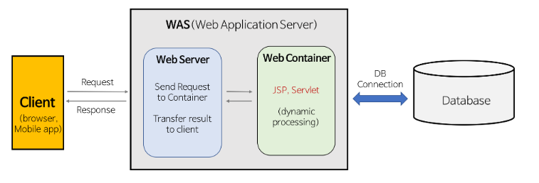

# 정적 웹 vs 동적 웹

### 정적 웹

- 정해진 js, css, html을 웹 서버에서 다운 받음
- DB, 비즈니스 로직이 없는 고정된 웹 페이지를 사용자에게 제공

### 동적 웹

- js, css, Html 뿐만 아니라 클라이언트 요청에 따라 DB에게 필요한 정보를 받아오고 수정할 수 있음.

### Web Server

client에게 정적인 컨텐츠를 제공하는 프로그램

- WAS를 거치지 않고 정적인 컨텐츠를 Client에게 제공합니다
- WAS에게 동적인 정보를 요청합니다.

###  Web Application Server 

DB 조회 및 다양한 로직 처리 시 동적인 컨텐츠를 제공하는 애플리케이션 서버, 미들웨어(엔진) 입니다.

- 웹 서버의 역할인 정적인 데이터를 전달할  수 있으며, DB와 통신하여 동적인 정보도 전달할 수 있음.
- 트랜잭션 관리 가능

### WAS만이 아니라 Web Server도 사용하는 이유

- 기능 분리를 통한, 서버 부하 방지 및 속도 향상
  - WAS는 항상 자원이 부족할 가능성이 높으며, 이런 분리를 하지 않으면 속도가 느릴 수도 있음
- 물리적 분리를 통해서 보안 강화 및 SSL 암복화화 처리를 통한 보안 강화
- 여러 개의 web server를 사용가능 
  - 로드 밸런싱의 역할로 이용 가능
  - failover(장애 대비 기능, 예비시스템 전환) , failback(장애 발생 전으로 되돌리는 처리)에 유리
- 여러 웹 어플리케이션 서비스 가능
- 접근 허용 ip 관리, 세션 관리 등 기타 부가적인 장점도 존재

### 통신 과정

가장 많이 사용하는 통신 구조는 아래와 같다.

Client(ex. brower) -> WebServer(ex. apache web server, Nginx) -> WebApplicationServer(ex. Node.js, Apache Tomcat) -> DB(ex. mySql)

### 더 공부하면 좋을 점

- WAS 내부 구조, JSP, Servlet 등등
- 통신 Architecture
- 로드밸런싱

### 참고

https://dev-donghwan.tistory.com/90
https://hyuntaekhong.github.io/blog/WAS/

https://gmlwjd9405.github.io/2018/10/27/webserver-vs-was.html

