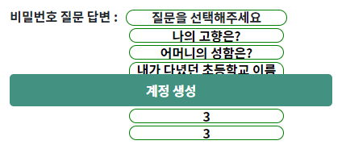
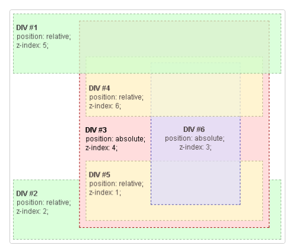
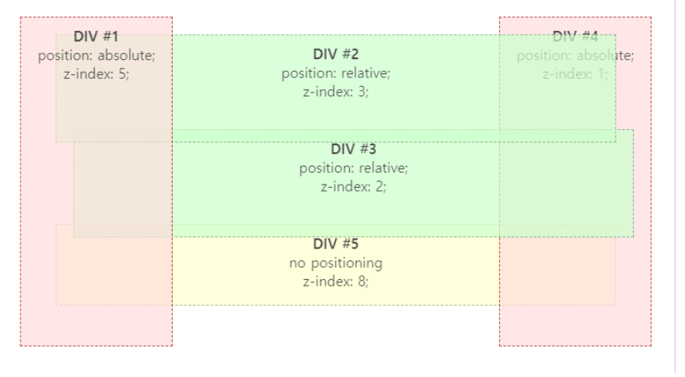

# **stacking order and z-index**

# 공부한 이유

- z-index가 99999999 여도 특정 컴포넌트에게 항상 덮이는 경우가 발생했다.
- 구체적으로 저는 아래 그림처럼 드랍다운이 기본버튼에 덮여서 클릭할 수가 없었습니다.





### 원인과 해결법

- 원인: stacking order 이라는 web의 기본 순서를 정하는 로직이 z-index보다 우선 되기 때문에 일어나는 현상이다.
- 해결법 : position 속성을 부여하면 된다.

### stacking order

- web은 기본적으로 아래에서 위로 쌓이는 데(stacking) 아래 세가지 기준으로 쌓이게됩니다.

1. 루트 요소의 배경과 테두리
2. (HTML에 나타나는 순서대로) 자식 엘리먼트들
3. (HTML에 나타나는 순서대로) position이 지정된 자식 엘리멘트

※ 참고 노트 : “positon이 지정되면 후에 렌더링이 된다”

```
position 속성이 지정되지 않은 블록은 항상 position이 지정된 엘리먼트 이전에 렌더링 된다. 
따라서 position이 지정된 엘리먼트 아래에 보인다. 
설령 HTML 문서상에서 먼저 나오더라도 position이 지정되지 않은 엘리먼트는 지정된 엘리먼트보다 아래에 보인다.
```

### 예시1. 하위요소 렌더링

```
<div id={1} z-index:5/>
<div id={2} z-index:2/>
<div id={3} z-index:4>
	<div id=4} z-index:6/
	<div id={5} z-index:1/
	<div id={6} z-index:3/
<div/>
```





- 이 경우 div #4,5,6은 div#3에 속해있기 때문에, div#1,2,3에 위치가 정해진 후 div #3내에서 div#4,5,6의 z-index가 적용된다

### 예시2. position이 없을 경우





- 이 경우 div#5는 포지션이 없기 때문에 가장 먼저 나타나서, z-index는 가장 높지만 가장 바닥에 깔린다.
- 위에서 드랍다운 같은 경우도 먼저 드랍다운이 HTML에 나타나고 그 이후 버튼이 HTML에 나타나기 때문에, 포지션이 겹칠 때, 나중에 나타난 버튼에 덮이게 된다. 그래서 position 속성을 부여하여 나타나는 순서를 늦추면 해결이 된다.

### 다음 공부요소

- 쓰면서 렌더링이란 표현했다가 수정했는데, 공식문서에서 in order of appearance in the HTML 라 사용했기 때문이다. 이 두 가지 차이점을 몰라서 공부해 볼 것 같다.

### 참고문서

- https://developer.mozilla.org/en-US/docs/Web/CSS/CSS_Positioning/Understanding_z_index/Stacking_without_z-index
- https://developer.mozilla.org/en-US/docs/Web/CSS/CSS_Positioning/Understanding_z_index/The_stacking_context
- https://developer.mozilla.org/ko/docs/Web/CSS/CSS_Positioning/Understanding_z_index/Stacking_without_z-index