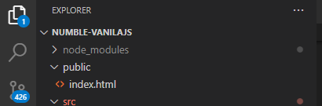
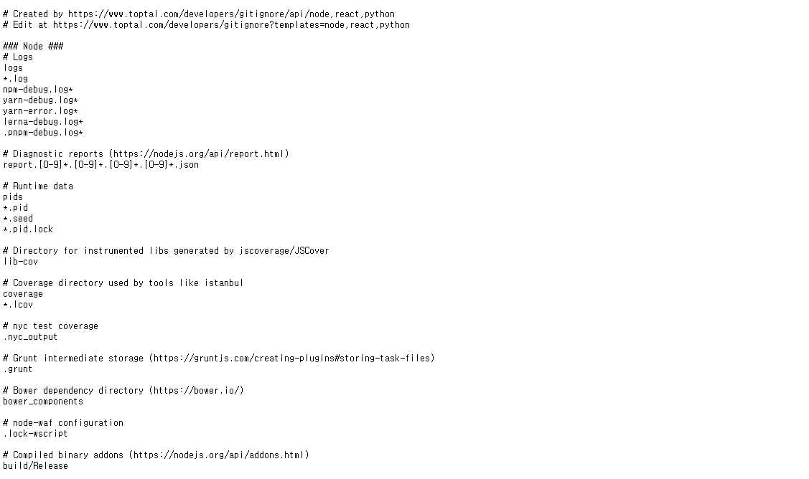
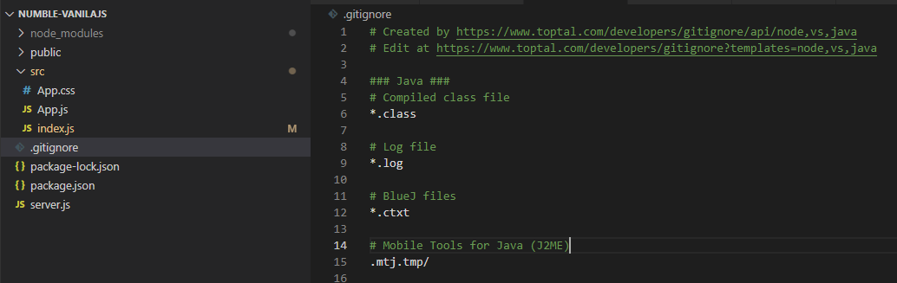

# gitignore.io를 이용하여 .gitignore 생성하기

git을 사용하다보면, git을 통해서 관리하기 애매한 파일들이 존재한다.

\- 보안상 위험이 있는 파일

\- 프로젝트와 관계가 없거나 무의미한 변동사항이 너무 많은 파일

\- 용량이 너무 큰 파일

이런 생략해야하는 파일을 모아둔 파일이 **.gitingore** 이다. 이를 통해서 핵심파일들을 관리할 수 있다.

ex). node_modules

아래 참조에 적힌대로 여러가지 룰 등을 통해서 직접 파일을 제외할 파일을 정하는 것도 좋지만, .gitignore.io 사이트를 통해서 프로젝트 생성시에는 디폴트값을 만드는 것이 편하다.

https://www.toptal.com/developers/gitignore 

사이트에 접속해서, 자주 사용하는 프레임워크나 라이브러리를 입력하고 생성하면 아래 그림처럼 해당 라이브러리에서 제외하면 좋은 목록들을 담은 텍스트가 나오고 해당 텍스트를 복사(ctrl + a, ctrl c)하면 된다.

사이트!

결과물!

하고 복사한 결과물을 아래처럼 .gitignore 파일을 만들어서 그 안에 붙여넣으면 된다.

vscode를 사용하면 아이콘도 바뀌어서 알아보기 편하다.

#### **참조**

깃공식 : https://git-scm.com/docs/gitignore

gitignore.io : https://www.toptal.com/developers/gitignore