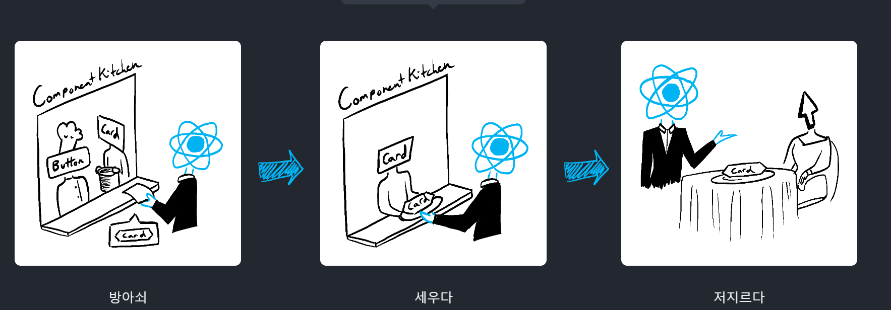
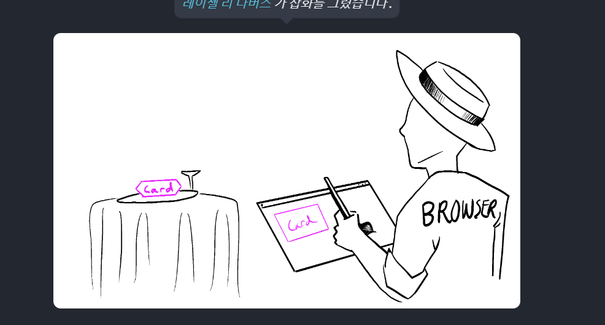

# Render and Commit

[render and commit](https://react.dev/learn/render-and-commit)

### 렌더링이 일어나는 과정

1. 렌더링 트리거
2. 컴포넌트 렌더링
3. Dom에 commit

### Rendering Trigger

1. 최초 렌더링

2. component state update

### Rendering Component

1. 최초 렌더링 시, Root Component를 호출합니다.
2. 리렌더링 시, 어떤 속성이 변경되었는 지를 계산합니다. (다음 단계까지, 아무것도 하지 않습니다.)

※ 주의사항 : 렌더링은 항상 순수해야합니다. 순수하지 않은 렌더링은 혼란스러운 버그와 예측할 수 없는 동작을 만들어냅니다. `Strict Mode`는 React를 순수하게 만듭니다.

※ 성능 최적화 : 트리 상단에서 중첩 요소들을 렌더링 시, 성능이 최적화되지 않습니다. [최적화](https://legacy.reactjs.org/docs/optimizing-performance.html)하는 여러 방법으로 해결할 수 있습니다. 하지만, 성급해서는 안됩니다.

### React commits changes to the DOM

1. 최초 렌더링 시, appendChild Dom API를 이용하여 Dom Node를 화면에 표시합니다.
2. 리렌더링 시, 최신 렌더링과 일치시키기 위한 최소한의 작업만 수행합니다.
   - 렌더링간 차이가 있을 경우에만, Dom노드를 변경합니다.
   - 차이가 없는 노드는 건드리지 않습니다.

이 작업이 완료되면 브라우져는 화면을 다시 그립니다. 이 과정을 `페인트` 라 부릅니다.

※ 브라우져 렌더링도 맞는 표현입니다.

