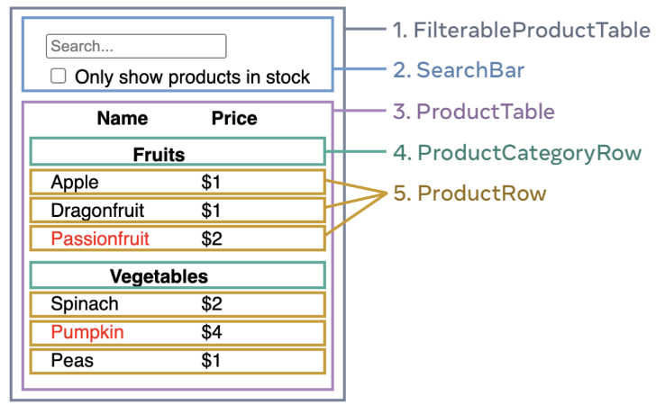

# Think in React

[Think in React](https://react.dev/learn/thinking-in-react)


글의 목적 : react의 컴포넌트 설계법 공유


### step1. UI를 컴포넌트 계층에 따라서 분리하기

디자이너와 함께 전체를 여러 컴포넌트로 나누라 조언합니다.


컴포넌트는 여러 방법으로 나눌 수 있습니다.

- 프로그래밍 : `단일 책임 원칙`에 따라서, 컴포넌트는 이상적으로 한 가지의 일만 해야합니다. (새 함수나 새 객체가 필요한 지는 해당 책임을 담당하고 있는 요소가 있는 지 없는 지에 따라서 판별합니다.)
- CSS : 클래스 선택자를 무엇에 선택할 지 고려합니다.
- 디자인 : 디자인의 레이어를 어떻게 구성할 지 고려해보세요.


JSON이 잘 구조화되어있다면, UI와 데이터 모델이 일치할 것입니다. 이를 기반으로 UI를 구성요소로 분해하세요.





컴포넌트를 잘 식별했다면, 계층 구조로 정렬합니다.

```
- FilterableProductTable
	- SearchBar
	- ProductTable
		- ProductCategoryRow
		- ProductRow
```


### step2. 정적인 버전 만들기

step1에서 나눈 계층 구조와 동일하게 정적인 코드로 앱을 구현합니다. 이 때, 상호작용과 상태가 없이 단순하게 구현합니다. 

"top-down" 과 "bottom-up" 중 편한 방법을 선택하여 구현합니다. 

간단한 예에서는 상향식이 쉬우며, 큰 프로젝트일수록 하향식이 쉽습니다.

또한, 이 계층구조에서 부모로부터 자식으로 데이터는 한 방향으로 흐른다는 것을 알 수 있습니다.(one-way data flow)


### step3. UI를 표현하는 가장 작고 완벽한 State를 찾아라

UI의 상호작용을 위해서는 데이터 모델의 변화를 나타내는 state가 필요합니다.


state는 최소한의 변경 가능한 데이터 집합이라 생각하세요.

이를 구조화하는데 중요한 원칙은 "DRY(Don't Repeat Yourself)"입니다.

반드시 필요한 정보만을 state로 가지고, 필요에 따라서 state 계산하여 사용하세요.


다음 정보들은 state가 아닙니다.

- 시간이 지나도 변하지 않는 값
- 부모로부터 props를 통해 전달되는 값
- 컴포넌트에 있는 기존 상태나 props를 기반으로 계산되는 값


※ props vs state

- props : 함수의 인수로 부모로부터 전달받은 값.

- state : 컴포넌트의 메모리로, 상호작용을 통해서 변경되는 


### step4.  state가 어디에 있어야 하는 지 명시할 것.(어느 컴포넌트에 있어야 하는 지)

1. state에 의하여 렌더링되는 모든 컴포넌트를 식별할 것.
2. 렌더링 되는 모든 구성요소에서 공통된 부모 컴포넌트 중 가장 가까운 것을 찾을 것.
3. 상태가 어디 있어할 지 이를 바탕으로 결정할 것
   - 공통 부모
   - 공통 부모 상위에 있는 기존 컴포넌트
   - (공통 부모와 상위 컴포넌트가 적합하지 않을 경우) 공통 부모 상위 컴포넌트 생성


### step5. 역방향 데이터 흐름 추가

state를 위에서 아래로 보내므로, state를 변경하는 함수(setState) 또한 위에서 아래로 전달해야하며, 적절하게 이를 추가해야합니다.
