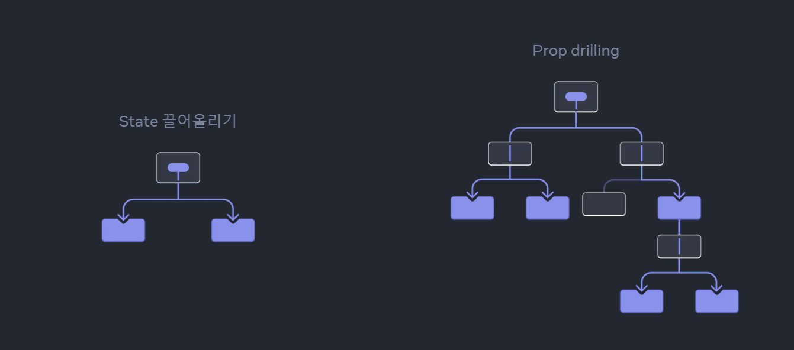
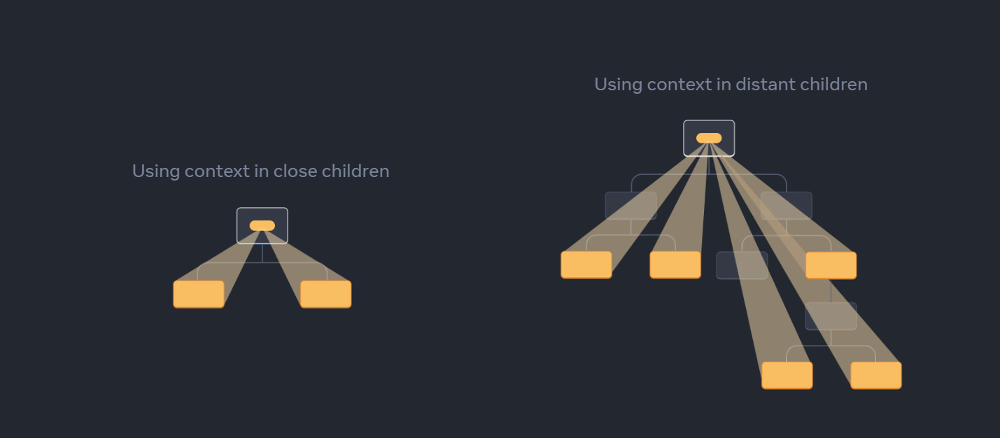

# Context 개념 & useContext & createContext

[Passing Data Deeply with Context](https://react.dev/learn/passing-data-deeply-with-context)

[useContext](https://react.dev/reference/react/useContext)

[createContext](https://ko.react.dev/reference/react/createContext)


[ 개요]

- 문제 : 부모에서 자식으로 props로 데이터를 전달하는 과정이 불편할 수 있다. (props drilling)
- 해결책 :  `Context API`를 이용하면 트리의 하위 구성 요소에 대해서 깊이와 관계없이 데이터를 전달할 수 있다.


### 문제 : Props Drilling

props를 전달할 때, 공통의 state가 필요할 경우 부모에서 필요한 경우가 많다. 이 때, 이를 너무 깊은 곳에 있는 컴포넌트가 필요한 경우 "props drilling"을 초래할 수 있다.


※ props drilling : props 데이터가 너무 깊은 곳으로 전달되는 현상. 중간 컴포넌트들이 오직 데이터 전달의 역할을 수행하는데, 이 때문에 중간 컴포넌트는 불필요한 정보가 많아져서 복잡해진다. 또한, 데이터의 역추적이 매우 어려워진다. (추적하다보면 매우 많은 컴포넌트들을 살펴봐야한다.)




### 해결책 : useContext

useContext는 이를 순간이동 시켜서, 어디서든 사용할 수 있게 만드는 hook입니다.

context를 만들고, 이를 필요한 부분에서 선언해서 사용합니다.




[선언]

```react
import { createContext } from 'react';

export const LevelContext = createContext(1);
```

전역변수로써 공유하고자 하는 값을 생성합니다.


[제공]

```react
import { LevelContext } from './LevelContext.js';

export default function Section({ level, children }) {
  return (
    <section className="section">
      <LevelContext.Provider value={level}>
        {children}
      </LevelContext.Provider>
    </section>
  );
}
```

제공부(provider)를 선언합니다. provider 아래 자식들은 `levelContext`의 값을 사용할 수 있습니다.

이 때, 호출하는 컴포넌트에서 가장 가까운 컨텍스트 provider의 value를 가져옵니다.


[사용]

```react
export default function Heading({ children }) {
  const level = useContext(LevelContext);
  // ...
}
```

이렇게 가져와서 사용하면된다.


### Context로 중간 컴포넌트 통과하기


[참고 예시](https://ko.react.dev/learn/passing-data-deeply-with-context#context-passes-through-intermediate-components)

react의 예시 코드를 보면, 같은 코드를 재사용한다.

```react
export default function Section({ children, isFancy }) {
  const level = useContext(LevelContext);
  return (
    <section className={
      'section ' +
      (isFancy ? 'fancy' : '')
    }>
      <LevelContext.Provider value={level + 1}>
        {children}
      </LevelContext.Provider>
    </section>
  );
}
```

**여기서, level이 모든 곳에서 같은 게 아니라 어디서 렌더링되고, 어떤 컨텍스트에 있는 지에 따라서 주변에 적응(adapt to their surroundings)하여 값을 다르게 표시합니다.**


 [CSS property inheritance](https://developer.mozilla.org/en-US/docs/Web/CSS/inheritance)와 유사한 방식으로 작동하여 아래 값을 받게됩니다. 이 때, 어떤 컨텍스트를 오버라이드(덮어쓰기)하는 유일한 방법은 자식 컴포넌트를 다른 값을 설정된 context provider 안에 감싸는 것입니다.


css가 다른 속성을 서로 오버라이드 하지 않듯이, react의 context들은 서로를 오버라이드하지 않습니다. 따라서, 하나의 컴포넌트 안에서 여러 context를 사용하고 제공할 수 있습니다.


### Context 사용 전, 고려할 것

context는 좋지만 남용하기 좋습니다. 사용 전에 다음을 고려해봐야합니다. 아래 방법들이 맞지 않는다면, 그 때 고려해보세요.


1. props로 전달하기.

2. 자식을 JSX로 전달하기

   

context를 사용하기 좋은 예시들은 테마, 현재 계정 정보, 라우팅, 상태 관리 등이 있습니다.

context는 정적인 값으로 제한되지 않기에, reducer와 state와 함께 자주 조합되어 사용됩니다.


### Context 사용 시, 주의사항

- context 기본값 지정 : provider를 찾을 수 없는 경우, 생성 시 선택한 기본값을 사용하게 된다.
- context 재정의 : 다른 값을 사용하고 싶다면, 트리 내누에 컨텍스트를 재정의하여서 사용할 수 있다.
- context 재렌더링 최적화 : context에 사용하는 함수나 객체는 리렌더링 시, 바뀐 점이 없음에도 다른 값으로 인식 될 수 있다. 이 부분은 큰 앱에서 문제가 될 수 있으므로, useCallback과 useMemo를 이용하여 최적화하면 좋다.

```react
import { useCallback, useMemo } from 'react';

function MyApp() {
  const [currentUser, setCurrentUser] = useState(null);

  const login = useCallback((response) => {
    storeCredentials(response.credentials);
    setCurrentUser(response.user);
  }, []);

  const contextValue = useMemo(() => ({
    currentUser,
    login
  }), [currentUser, login]);

  return (
    <AuthContext.Provider value={contextValue}>
      <Page />
    </AuthContext.Provider>
  );
}
```


### 요약

- Context는 컴포넌트가 트리 상 아래에 위치한 모든 곳에 데이터를 제공하도록 합니다.
- Context를 전달하려면 다음과 같습니다
  1. `export const MyContext = createContext(defaultValue)`로 context를 생성하고 내보내세요.
  2. `useContext(MyContext)` Hook에 전달해 얼마나 깊이 있든 자식 컴포넌트가 읽을 수 있도록 합니다.
  3. 자식을 `<MyContext.Provider value={...}>`로 감싸 부모로부터 context를 받도록 합니다.
- Context는 중간의 어떤 컴포넌트도 지나갈 수 있습니다.
- Context를 활용해 “주변에 적응하는” 컴포넌트를 작성할 수 있습니다.
- Context를 사용하기 전에 props를 전달하거나 JSX를 `children`으로 전달하는 것을 먼저 시도해보세요.
