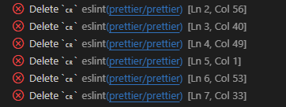

https://medium.com/bootdotdev/how-to-get-consistent-line-breaks-in-vs-code-lf-vs-crlf-e1583bf0f0b6

https://classic.yarnpkg.com/en/docs/install#windows-stable

https://stackoverflow.com/questions/29689966/how-to-define-type-for-a-function-callback-as-any-function-type-not-universal

https://ko.javascript.info/switch

https://www.npmjs.com/package/mobx-react

https://mobx.js.org/defining-data-stores.html#domain-stores

https://www.typescriptlang.org/docs/handbook/2/classes.html

https://hbase.tistory.com/334

https://classic.yarnpkg.com/en/docs/cli/add

https://stackoverflow.com/questions/29689966/how-to-define-type-for-a-function-callback-as-any-function-type-not-universal

https://yarnpkg.com/package/recharts