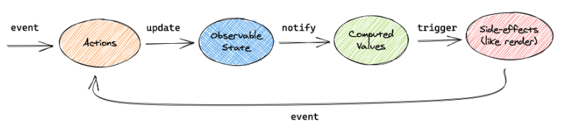

# Mobx 개론

렌더링 최적화, 비동기 데이터 변경을 위해서 사용하는 상태관리 라이브러리

### 원리

1. 모든 event(click... )는 observable state를 변경시키는 action을 호출합니다.
2. 변화한 observable state는 모든 연산값과 관련된 부수효과에 전파됩니다. 

### 참고

https://ko.mobx.js.org/README.html

### 참고

https://ko.mobx.js.org/README.html